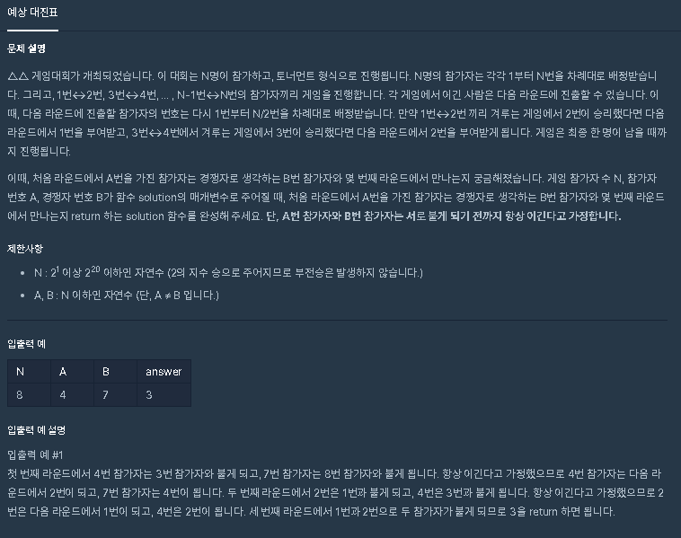

# 대진표

## 문제 내용



## My Think

1. 숫자를 2의 배수로 만들어주어 계산하기
   * 여기서 문제에서 나온 대로 대진 표를 생각하지 않아 시간이 끌림

## My Code

```text
class Solution
{
    public int solution(int n, int a, int b)
    {   int answer=1;
        int num=1;
        while(n!=1){
            a=(a%2==0?a:a+1);
            b=(b%2==0?b:b+1);
            if(a-b==0){
                answer = num;
                break;
            }else{
                num++;
                a = a/2;
                b = b/2;
            }
        }
        return answer;
    }
}
```

## Other's code


```text
class Solution
{
    public int solution(int n, int a, int b)
    {
        return Integer.toBinaryString((a-1)^(b-1)).length();
    }
}
```

2진수로 변환하여 문제를 푼 방식인데 참신했다.

