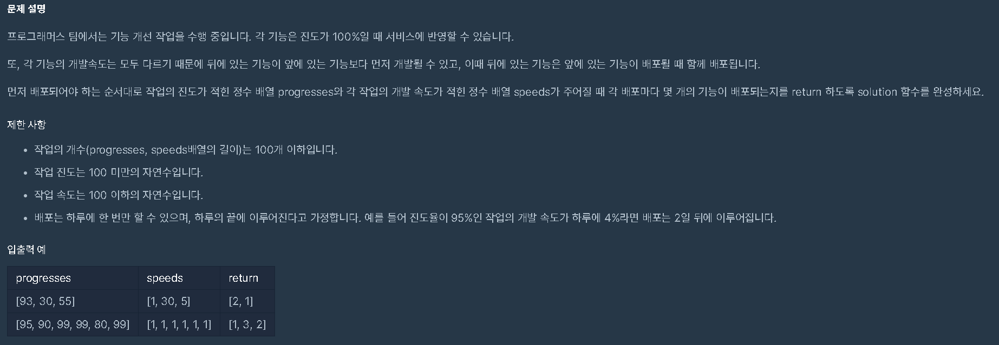

# 기능개발

## 문제 내용




## 문제 풀이에 대한 아이디

1. 남은 일수로 계산하기

   ```text
   day.add((100-prgresses[i])%speeds[i]==0?
                    (100-progresses[i])/speeds[i]:
                    (100-progresses[i])/speeds[i]+1);2.
   ```

2. 큐의 개념 적용

   가장 앞에 있는 원소를 없애면서 계


## 내 코드


```text
import java.util.*;
class Solution {
    public ArrayList<Integer> solution(int[] progresses, int[] speeds) {
        ArrayList<Integer> answer = new ArrayList<Integer>();
        ArrayList<Integer> day = new ArrayList<>();
        for(int i = 0; i < progresses.length ; i++){
            day.add((100-progresses[i])%speeds[i]==0?
                 (100-progresses[i])/speeds[i]:
                 (100-progresses[i])/speeds[i]+1);
        }
        int thr = day.get(0);
        int num = 0;
        int index = day.size();
        while(index!=0){   
            if(day.get(0)<=thr){
                day.remove(0);
                num++;
            }else{
                thr = day.get(0);
                day.remove(0);
                answer.add(num);
                num = 1;
            }            
            index --;
            if(index==0){
                answer.add(num);
            }
        }
        return answer;
    }
}
```


